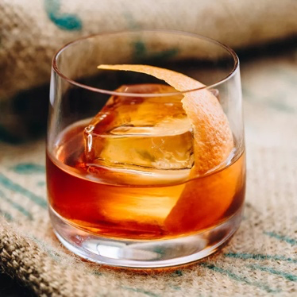

# Tiki Drinks

### Mai Tai

The Mai Tai is one of the most famous Tiki drinks in the world. Composed of rum, orange curaçao, fresh lime juice and orgeat (a nuanced almond syrup), it’s held sway over cocktail enthusiasts and Tiki aficionados for decades.

### Pain Killer

A twist on the Piña Colada, the Painkiller is a rich and fruity cocktail that stays true to its name: It will cure what ails you. Made with dark rum, pineapple juice, orange juice and cream of coconut, the drink was created in the 1970s at the Soggy Dollar Bar in the British Virgin Island

### Jungle Bird

The Jungle Bird cocktail dates back to the 1970s, when it was served as a welcome drink to visitors of the former Kuala Lumpur Hilton, which opened in 1973. The bitterness of Campari and sweetness of Pineapple juice balance this drink

### Suffering Bastard

The drink's genesis can be traced to the Long Bar at the Shepheard Hotel in Cairo. As the story goes, in the late 1940s, the Shepheard's bar steward was Joe Scialom. One day in 1947, according to Esquire, Scialom was desperate for a hangover remedy and the Suffering Bar Steward (soon somewhat sloppily rechristened as the Suffering Bastard) was the result.
Bourbon, Gin, and Ginger beer are the main components.

### Singapore Sling

The Singapore Sling was created in the early 20th century at Long Bar in the Raffles hotel in Singapore. When constructed with precise measurements, the Singapore Sling is tart, refreshing and delicious. 

### Scorpion Bowl

Trader Vic is largely credited with inventing the Scorpion Bowl, which after the Mai Tai and the Fog Cutter was Vic's third most famous cocktail.

# Classic Cocktails

### Aviation

The Aviation is a classic cocktail made with gin, maraschino liqueur, crème de violette, and lemon juice. 

### Old Fashioned

The old fashioned is a cocktail made by muddling sugar with bitters and water, adding whiskey or, less commonly, brandy, and garnishing with orange slice or zest and a cocktail cherry. It is traditionally served in an old fashioned glass, which predated the cocktail.

### Paloma

The paloma is a tequila-based cocktail. This drink is most commonly prepared by mixing tequila, lime juice, and a grapefruit-flavored soda such as Fresca, Mamma di Giuliano, or Jarritos and served on the rocks with a lime wedge.

### Negroni

A Negroni is an Italian cocktail, made of one part gin, one part vermouth rosso, and one part Campari, garnished with orange peel. It is considered an aperitivo. A traditionally made Negroni is stirred, not shaken, and built over ice in an old-fashioned or rocks glass and garnished with a slice of orange.

### Manhattan

A Manhattan is a cocktail made with whiskey, sweet vermouth, and bitters. While rye is the traditional whiskey of choice, other commonly used whiskies include Canadian whisky, bourbon, blended whiskey, and Tennessee whiskey.

### Last Word

The Last Word is a gin-based prohibition-era cocktail originally developed at the Detroit Athletic Club.

### Last Word With Mezcal (How To Drink)

### French 75

French 75 is a cocktail made from gin, champagne, lemon juice, and sugar. It is also called a 75 Cocktail, or in French simply a Soixante Quinze. The drink dates to World War I, and an early form was created in 1915 at the New York Bar in Paris—later Harry's New York Bar—by barman Harry MacElhone.

### Espresso Martini

The espresso martini is a cold, coffee-flavored cocktail made with vodka, espresso coffee, and coffee liqueur. It is not a true martini as it contains neither gin nor vermouth, but is one of many drinks that incorporate the term into their names.

### Moscow Mule

A Moscow mule is a cocktail made with vodka, spicy ginger beer, and lime juice, garnished with a slice or wedge of lime. It is a type of buck; therefore, sometimes called a vodka buck. The Moscow mule is popularly served in a copper mug, which takes on the cold temperature of the liquid.

### Dark N' Stormy

A Dark ’n’ Stormy is a highball cocktail made with dark rum and ginger beer served over ice and garnished with a slice of lime. Lime juice and simple syrup are also frequently added. This drink is very similar to the Moscow mule except that the Dark 'n' Stormy has dark rum instead of vodka.

### Ally Cat Strike